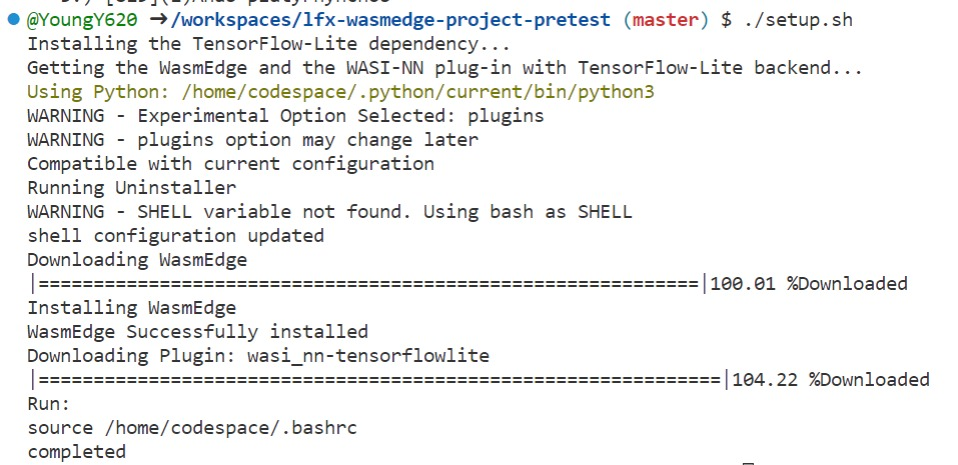
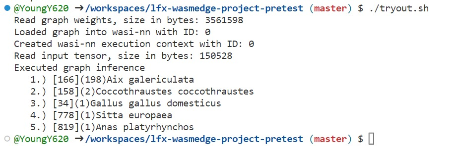

# lfx-wasmedge-project-pretest
LFX Mentorship 2023 01-Mar-May Challenge #2230.

## Step 1

In `setup.sh`: 

```bash
#!/bin/bash
echo "Installing the TensorFlow-Lite dependency..."
curl -s -L -O --remote-name-all https://github.com/second-state/WasmEdge-tensorflow-deps/releases/download/0.11.2/WasmEdge-tensorflow-deps-TFLite-0.11.2-manylinux2014_x86_64.tar.gz
tar -zxf WasmEdge-tensorflow-deps-TFLite-0.11.2-manylinux2014_x86_64.tar.gz
rm -f WasmEdge-tensorflow-deps-TFLite-0.11.2-manylinux2014_x86_64.tar.gz
mv libtensorflowlite_c.so /usr/local/lib
echo "export LD_LIBRARY_PATH=/usr/local/lib:${LD_LIBRARY_PATH}" >> ~/.bashrc

echo "Getting the WasmEdge and the WASI-NN plug-in with TensorFlow-Lite backend..."
curl -sSf https://raw.githubusercontent.com/WasmEdge/WasmEdge/master/utils/install.sh | bash -s -- -v 0.11.2 --plugins wasi_nn-tensorflowlite
source ~/.bashrc

echo "completed"
```

Output:



## Step 2

In `tryout.sh`:

```bash
#!/bin/bash
curl -sLO https://github.com/second-state/WasmEdge-WASINN-examples/raw/master/tflite-birds_v1-image/wasmedge-wasinn-example-tflite-bird-image.wasm
curl -sLO https://github.com/second-state/WasmEdge-WASINN-examples/raw/master/tflite-birds_v1-image/lite-model_aiy_vision_classifier_birds_V1_3.tflite
curl -sLO https://github.com/second-state/WasmEdge-WASINN-examples/raw/master/tflite-birds_v1-image/bird.jpg

wasmedge --dir .:. wasmedge-wasinn-example-tflite-bird-image.wasm lite-model_aiy_vision_classifier_birds_V1_3.tflite bird.jpg
```

Output:


